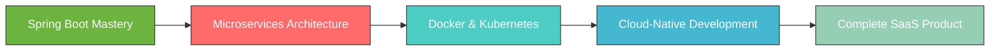

# 👋 Hello, I'm Ahmed Dachraoui

  

  
  

---

## 🎯 About Me

> *Transforming ideas into robust, scalable applications with clean architecture and modern technologies*

- 🔭 **Currently Working On:** Microservices architecture with Spring Boot & Docker
- 🌱 **Learning:** Advanced Spring Cloud, Kubernetes, and Cloud-Native Development
- 🎯 **Goal:** Building a complete SaaS product from conception to deployment
- 💡 **Passion:** Creating innovative solutions that solve real-world problems
- 📍 **Location:** Tunisia
- 💪 **Mission:** Growing stronger in tech and fostering meaningful connections

---

## 🛠️ Tech Stack & Expertise

### 🖥️ **Backend Development**

### 🎨 **Frontend Development**

### 🗄️ **Databases**

### 🔧 **DevOps & Tools**

### 🤖 **Additional Skills**

---

## 🚀 Featured Projects

### 📚 [Book Social Network](https://github.com/dachraoui-ui/book-social-network)
*A comprehensive full-stack social platform for book enthusiasts*

**Key Features:**
- 🔐 JWT Authentication & Authorization
- 📖 Book sharing and reviewing system
- 👥 Social networking features
- 📱 Responsive Angular frontend
- 🐳 Dockerized deployment

---

### ⚽ [Football Face Recognition AI](https://github.com/dachraoui-ui/face_recognition_with_gui)
*Intelligent player recognition system using Computer Vision*

**Key Features:**
- 🎯 Real-time face detection and recognition
- 🏆 Football player identification
- 🖥️ User-friendly GUI interface
- 📊 High accuracy ML models

---

### 👔 [RH Management System](https://github.com/dachraoui-ui/rh-app)
*Enterprise HR management solution with advanced security*

**Key Features:**
- 🔒 Keycloak integration for SSO
- 👥 Employee management system
- 📋 Role-based access control
- 📈 Performance tracking

## 🎯 Current Focus & Learning Path

**🎯 2024-2025 Goals:**
- 🏗️ Master Microservices with Spring Cloud
- ☁️ Deploy applications on AWS/Azure
- 🚀 Launch my first SaaS product
- 📚 Contribute to open-source projects
- 🤝 Build a strong tech community presence

---

## 📫 Let's Connect & Collaborate

---

  
### 💭 *"Code is poetry written in logic. Every application tells a story of problems solved and dreams realized."*

**🌟 Always open to interesting conversations and collaboration opportunities!**

---

  

